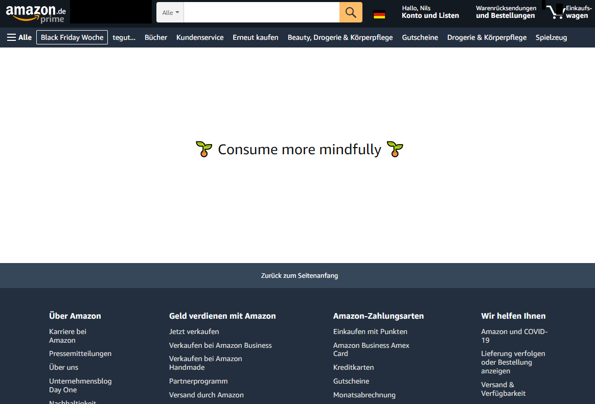

# Chrome Extension for mindful browsing

The aim of this project is to create a browser extension that facilitates mindfulness when browsing on the internet.

For example, it removes the content of Amazon's starting page:

